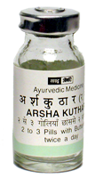

# Arshakuthar Ras

[TOC]

1. By its laxative (Baliospermum montanum Euphorbia nerifolia) action corrects constipation and thus related complications.
1. It relieves other symptoms of pilles like pain, pruritis ani and mucous discharge.
1. It is especially indicated in cases of non-bleeding piles.
1. In bleeding piles it should always be given with Sandu [Kutajarishta](../medicines/Kutajarishta.md).
1. It is also helpful to correct the anaemia arising due to bleeding piles.
1. By its cholagogue, Carminative and digestive action corrects liver function, relieves flatulence and improves digestion.

## Indication
Hemorrhoids

## Dosage
1-2 tablet 2 times

## Ingredients
[Kajjali](Kajjali.md), Lohabhasma, Abhrakbhasma, Aegle marmelos, Plumbago zeylanica,
Gloriosa superba, Piper longum, Piper nigrum, Zingiber officinalis, Fumaria vaillantii, Baliospermum montanum, Tankan, Yavkshar, Rocksalt, Calotropis procera, Euphorbia nerifolia.
