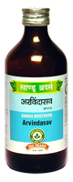

# Arvindasav

[TOC]

* Duplicate of: Arvindasava*

It improves appetite and digestion of children helps in proper absorption and assimilation of food. It provides nutrition and strength to body. It is useful in Ricketts. It pacifies vitiated pitta[dosha](dosha.md) useful in burning micturition and dysuria.
It is also useful in menorrhagea and leucorrhoea.

## Indication
Anorexia, Ricketts, Underweight, Indigestion, Burning micturition and dysuria, leucorrhoea, menorrhagea,coughconstipation and other disorder of children.

## Dose
15-30ml after meal with equal quantity of water or as directed by the physician.

## Ingredients
Nelumbo nucifera, Vetiveria zizanioidis, Gmelina arborea, Nymphaea nouchali, Rubia cordifolia, Elettaria cardamomum, Sida cordifolia, Nardostachys jatamansi, Cyperus rotundus, Hemidesmus indicus, Terminalia chebula, Terminalia, bellerica, Acorus calamus, Emblica officinalis, Hedychium spicatum, Operculina turpethum, Trichosanthes dioica, Fumaria vaillantii , Terminalia arjuna, Glycyrrhiza glabra, Marsdenia tenacissima, Vitis vinifera.
