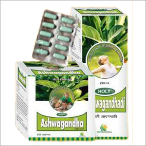

# Ashwagandha Gutika

Ashwagandhadi can be used as a foundation for the management of any chronic disorder, or to promote optimum health and energy levels. It should be specifically considered for people with depressed mood, fatigue, digestive complaints, memory enhancement, and the effects of aging.  It can also be used as a supportive health measure during times of excess physical or mental stress.

Ashwagandhadi may be especially helpful for people that are in poor health. It contains herbs that are traditionally beneficial to the digestive system, liver, endocrine system, adrenal system, and circulatory system.

## SYRUP COMPOSITION
Each 10ml contains extracts of:-

* [Ashwagandha](Ashwagandha.md)(Withania somnifera) -                                 350mg
* Vidarikand(Ipomoea digitata) -                                        200mg
* Bharingraja (Eclipta alba) -                                          150mg
* [Brahmi](Brahmi.md)(Centella asiatica) -                                       150mg
* Giloy(Tinospora cordifolia) -                                         100mg
* Shilajit(Asphaltum) -                                                  50mg
