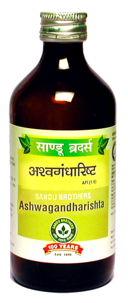

# Ashwagandharishta

[TOC]

It is very effective [ayurvedic medicine](ayurvedic_medicine.md) for mental fatigue. Being digestive, it corrects metabolism and helps to provide proper nutrition. It is effective in mental disorders. It has inflammatory action. It is a narvine tonic and helpes in neuritis. It is helpful in sexual disorders like erectile dysfunction and oligospermia.

## Indication
Fatigue, indigestion, psychological disorders, mental stress and strain, arthritis, nuritis, erectile dysfunction, oligospermia, etc.

## Dose
4 tab 2 times

## Ingredients
Withania Somnifra, Asparagus ascendens, Pueraria tuberosa, Teminalia arjuna, Hemidesmu, indicus, Santalum album etc.

## List of Ayurvedic herb in which used in this preparation
[Mesua ferrea linn](Mesua_ferrea_linn.md)

## References

## References

1. "Karnataka Medicinal Plants Volume - 2" by Dr.M. R. Gurudeva, Page No.346, Published by Divyachandra Prakashana, #45, Paapannana Tota, 1st Main road, Basaveshwara Nagara, Bengaluru.
