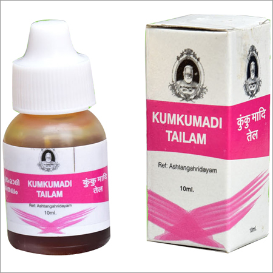

# Ayurvedantha Essential Oil

* **Kumkumadi Thailam** - Kumkumadi Thailam Fairness Oil helps in improving skin texture, complexion and relieving skin problems like; acne, scars etc. This oil consists varied herbs like [turmeric](turmeric.md) and [Sandal Wood](Sandal_Wood.md), which have the ability to lighten the skin tone.

* **Murivenna Pain Oil** - Murivenna Pain Oil is hugely used for Pichu oil procedure, wherein cotton swabs are dipped in this oil and applied over joints and sprain areas for quick pain relief.

* **Narayana Massage Oil (Ayurvedic Massage Oil)** - It is highly useful in improving bone strength in osteoporosis and arthritis also in joint disorders such as Osteo arthritis, lumbar, Rheumatoid arthritis and cervical spondylosis, gout.

* **Maha Narayana Tailam** - Maha Narayana Tailam - Massage Oil is Ayurvedic vata massage oil, which is particularly beneficial for treating bones and muscles pains. It offers flexibility to joints, therefore, widely used for arthritis pain, sprains and backaches. AS per the Ayurveda, the root cause of arthritis is poor digestion in the individual.

## External Links
* [Ayurvedantha](http://ayurvedantha.tradeindia.com/essential-oil.html)
