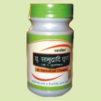

# Ayurvedic Churna

* **Avipattikar Churna**:- Avipattikar Churna is an [ayurvedic medicine](ayurvedic_medicine.md) used to cure problems related to indigestion.

* **Vr. Manjishtadi Churna**:- Vr. Manjishtadi is used for treatment of various health disorders and diseases.

* **Dashan Samskar Churna**:-  Darshan Samskar Churna is an effective and natural method for curing various health disorders, offers you the maximum relief.

## External Links
* [Sri Navjeewan Rasayanshala](http://www.srinavjeewanrasayanshala.com/ayurvedic-churna.htm)
