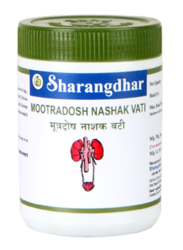

# Ayurvedic Vati

* **Mootra Doshnashak Vati**: This medicine shows immediate results for urinary tract infections and other complaints like stone, bladder inflammation, swelling, ulcer, summer sickness, passing pus, protein, and other urinary ailments.

* **Raktadosh Nashak Vati**: It helps to treats blisters, rashes, pimples, abcess and dandruff, these products are widely demanded in the industry.

* **[Chandraprabha Vati](../medicines/Chandraprabha_Vati.md)**: It helps to treat urinary disorders, chronic renal disease and menstrual disorder in female.

* **Raktadosh Nashak Vati**: It helps to purify the blood.

* **Pachak Vati**: It Improves the digestive power of the body and help to assimilate the food.

* **Sukhasarak Vati**: Sukhasarak Vati enables the smooth passage of bile and helps in bowel movement, so that your system remains clean.

* **Ayurvedic Pachak Vati**: It is helpful in digestion.

* **Raktavardhak Vati**: Improves hemoglobin level, these products boosts stamina and builds resistance against disease

* **Sukhasarak Vati**: This products helps you to enables smooth passage of bile and also, helps in bowel movement, so that the system remains clean.

## External Links
[Sharangdhar Pharmaceuticals Pvt. Ltd.](http://www.sharangdhar.in/ayurvedic-vati.html)
