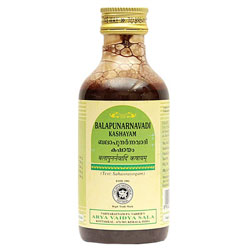

# Balapunarnavadi Kashayam

It is used to treat anorexia. It improves digestion and relieves bloating.

## Usage of Kottakkal Ayurveda Balapunarnavadi Kashayam
5 to 15 ml mixed with three times of boiled and cooled water or as directed by the physician.

Ingredients of Balapunarnavadi Kashayam
* Bala
* [Punarnava](Punarnava.md)
* Eranda
* Brihati
* Nidigdhika
* Gokshura
