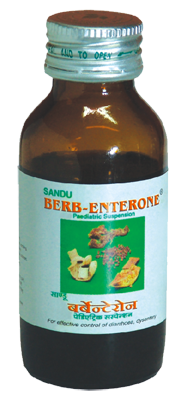

# Berbenteron Pediatric Suspension

[TOC]

**Prompt relief in children’s diarrhoea**

It is a combination of 9 essential herbs which provides prompt relief in diarrhoea and dysentery. It offers antibacterial, antiprotozoal and amoebic action. It also provides stomachic, antispasmodic and carminative action.

## Indications
Diarrhoea, Dysentery, Flatulence, teething Problem, abdominal colic and worm infestation .

## Dose
Infants:	20 drops 3-4 times
Children below 5 years:	½ tsf 3-4 times
Children above 5 years:	1 tsf  3-4 times

## Ingredients
1. [Daruharidra](Daruharidra.md) (Berberis aristata)
1. [Girimallika](Girimallika.md) (Holarrhena antidysenterica)
1. Aconitum hetrophyllum,
1. Cyperus rotundus,
1. Embelia ribes,
1. Punica granatum
1. Myristica fragrance,
1. Syzygium aromaticum,
1. Punica
1. granatum
1. Quercus infectorius
