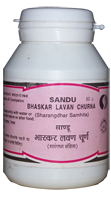

# Bhaskarlavan Churna

[TOC]

It acts as a sialogogue i.e. it increase salivary secretion. It has carminative action and helps eliminates gas from G.I tract. By chaolague action, it increases bile secretion in G.I. tract.

## Indication
1. Indigestion
1. anorexia
1. [constipation](constipation.md)
1. abdominal colic.

## Dose
1 to 2 tsf 2 times

## Ingredient
1. Samudra lavan
1. Souvarchal
1. Saindhava
1. Vid Lavan Piper longum
1. Piper nigrum
1. Zingiber officinale.
