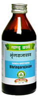

# Bhrungrajasava

It acts as a catalyst and enhances the action of other aphrodisiac medicines.
It strengthens the male reproductive system and corrects spematorrhoes. It is energizer and aphrodisiac. It is useful in female infertility. It is useful in premature graying of hair.

Indications:
Erectile dysfunction, Spermatorrhoea, premature ejaculation, cough, premature graying of hair.

Dose : 4 tsp 2 times

Ingredients: [Bhringa raja](Bhringa_raja.md) (Edipta alba), [Kayastha](Kayastha.md) (Terminalia chebula), Piper longum, Myristica fragrance, Carryophyllum aromaticum, Cinnamomum zeylanicum, jaggary etc.
