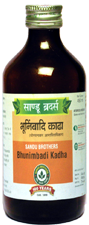

# Bhunimbadi Kadha

[TOC]

It is useful in the treatment of Acid-Peptic disorders. It has appetizer, Anti-inflammatory, laxative, cholagogue, digestive, antibacterial, haemostatic and rejuvenative property.

It helps to reduce inflammation of gastric mucosa. It helps to improve appetite and improves digestion. It increase the gastro- intestinal motility which helps in gastric emptying. It also provides relief from heaviness of abdomen, bloating of abdomen and constipation.
It’s haemostatic action helps to stop bleeding from garsto-duodinal ulcers.

## Ingredients
1. [Kalmegh](Kalmegh.md) (Andrographis paniculata)
1. [Nimba](Nimba.md) (Azadirachta indica)
1. [Amalaki](Amalaki.md) (Embelica officinalis)
1. Terminalia chebula,
1. Terminalia bellerica
1. Trichosanthes dioica
1. Adhatoda vasica
1. Tinospora cordifolia
1. Eclipta alba.

## Indications
1. Hyperacidity
1. Peptic ulcer
1. Gastritis
1. GERD

## Dose
4 teaspoonful twice a day with equal quantity of water.
