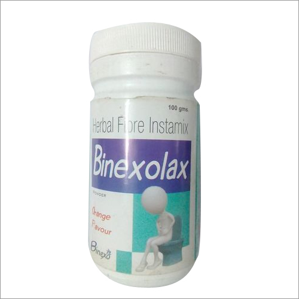

# Binexo Ayurvedic Powder

[TOC]

Laxatives cause the bowel to squeeze or contract to move the stools out. Laxatives add bulk and water to your stools. The larger stools help trigger the bowel to contract and move the stools out. Mucus, sludge, toxins and decaying matter can build up in your intestines causing you to suffer.

## POWDER COMPOSITION
Each gm contains:-

* Sonth (Zingiber officinale)-                                                                       20mg

* Nishotar (Operculina turpethum)-                                                         20mg

* Ajowan (Ptychotis ajowan)-                                                                     50mg

* Revand chini (    Rheum emodi)-                                                             50mg

* Saunf (Foeniculum vulgare)-                                                                   50mg

* Mulethi (Glycyrrhiza glabra)-                                                                  100mg

* [Amalaki](Amalaki.md)  (Triphala) -                                                                                                   110mg

* Senna leaves (Cassia angustifolia) -                                                       300mg

* Kala namak -                                                                                           300mg

## External Links
* [Binexo Pharmaceuticals](http://www.binexopharmaceuticals.com/ayurvedic-laxative-powder-3292974.html)
