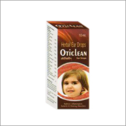

# Binexo Herbal Ear Drop

[TOC]

**Oticlean** - It is used to treat otitis media , otomycosis , tinnitus , meniere's disease , ear barotrauma.

## COMPOSITION:
Each ml drop contains

* Gangerruki    - 3.50%
* Kela mool     - 3.50%
* Baelgiri      - 3.50%
* Jalkumbi      - 5.00%
* Sahijan mool  - 5.00%
* [Tulsi plant](Tulsi_plant.md) oil     - 5.00%
* Tejbal oil    - 5.00%
* Sonth oil     - 5.00%
* Sathra oil    - 5.00%
* kalaunji oil  - 5.00%
* Cajuput oil   - 6.00%
* [Nimba](Nimba.md) (Neem) oil      - 6.00%
* Til oil       - q.s.

## External Links
* [Binexo Pharmaceuticals](http://www.binexopharmaceuticals.com/oticlean-3253397.html)
