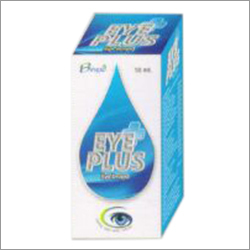

# Binexo Herbal Eye Drop

[TOC]

**Herbal Eye Drop** - These products are mainly used for treating diverse kinds of eyes infections.

## Each 10ml eye drops contains aqueous distillate of:
* Bharingraj (Eclipta alba) - 700mg

* Gulab pool (Rosa centifolia) - 700mg

* Daruhaldi (Berberis aristata) - 400mg

* [Tulsi plant](Tulsi_plant.md) (Ocimum sanctum) - 400mg

* [Punarnava](Punarnava.md) (Boerhaavia diffusa) - 400mg

* Jethimadh (Glycyrrhiza glabra) - 400mg

* [Nimba](Nimba.md) (Neem) (Azadirachta indica) - 400mg

* [Amalaki](Amalaki.md) (Triphala) - 400mg

* Lahsun (Allium sativum) - 400mg

* Ajowan (Ptychotis ajowan) - 200mg

* Pudina (Mentha piperata) - 150mg

* Chandan safed (Santalum album) - 100mg

* Chandan lal (Pterocarpus sentalinus) - 100mg

* [Madhu (Honey)](Madhu_(Honey).md)  (Mel) - 100mg

* Saindhav (Sodii chloridum) - 14mg

* Camphor (Camphora) - 6.5mg

## External Links
* [Binexo Pharmaceuticals](http://www.binexopharmaceuticals.com/herbal-eye-drop.html)
