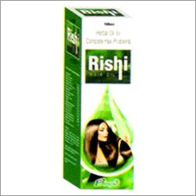

# Binexo Herbal Hair oil

[TOC]

**Rishi Grow Hair Oil** - The provided oil is ideally utilized for reducing hair fall with enhancing the growth and shine of hair.

## Each10 ml oil contains:-
* Bharingraj (Eclipta alba)   :    2.15%
* Javakusum (Hibiscus rosa-sinensis)  :  2.15%
* Dhatura (Datura metal)  :  2.15%
* [Brahmi](Brahmi.md) (Bacopa monnieri) : 2.15%
* [Amalaki](Amalaki.md) (Triphala)  :  2.15%
* Jatamansi (Nardostachys jatamansi)   : 2.15%
* [Nimba](Nimba.md) (Neem) (Azadirachta indica)  : 2.15%
* Wheat germ oil (Triticum sativum)   :      2.00%
* Lemon oil (Citrus limon) : 2.00%
* Chirongi oil (Buchanania latifolia) :     2.00%
* Rosemary oil (Rosmarinus officinalis)  :  2.00%
* Carrot oil 9daucus carota)  :  2.00%
* Lavender oil  (Lavendula officinalis)  :  2.00%
* [Coconut](Coconut.md) oil (Cocos nucifera) :  12.00%
* Soya bean oil (Glycine max)  : 15.00%
* Sun flower oil (Helianthus annuus)  :  q.s.

## External Links
* [Binexo Pharmaceuticals](http://www.binexopharmaceuticals.com/rishi-grow-hair-oil-3228510.html)
