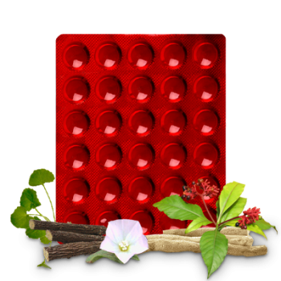

# Brento Tablet

[TOC]

Brento contains ingredients traditionally known as Medhya Rasayna which have been used since ancient times in conditions such as cognitive dysfunction, mental debility, lack of concentration.
For paediatric patients, Brento helps correcting disorders such as dyslexia and hyperkinesis.
Its indication are as follows: General mental debility, cognitive dysfunction, decreased vigilance, lack of concentration, loss of memory.
As a daily health supplement, Brento has been found to be of immense benefit for students, working people, professionals & elderly people with associated memory weakness.

## Composition
Tab [Aparajita](Aparajita.md) Shankhpushpi(Convolvulus microhyllus) 100 mg [Brahmi](Brahmi.md) (Bacopa monnieri) 100 mg [Ashwagandha](Ashwagandha.md)(Withania somnifera) 100 mg [Yashtimadhu](Yashtimadhu.md)(Glycyrrhiza glabra) 100 mg Kath (Saussurea lappa) 50 mg Vacha(Acorus calamus) 25 mg Sarpagandha(Rauwolfia serpentina) 25 mg Jatiphala(Myristica fragrans) 20 mg Chandroday(Suvarna ghatit Makradhwaj) 5 mg

## Dosage
Brento Tablets
Adults : 1-2 tablets thrice a day. Children : 1 tablet thrice a day.
A higher dosage is recommended for more severe & chronic conditions.

* Improves minor mental disorders. Brento induces mild tranquilizing effect and helps reduce anxiety.
