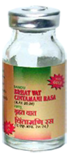

# Bruhat Vata Chintamani

[TOC]

**Useful in chronic diseases of musculoskeletal system**

* It is especially useful in chronic conditions.

1. Arrests progress of disorders in chronic and degenerative disorders
1. Strengthens nerves and central nervous system
1. Restores mobility of joints
1. Useful in Central nervous system disorders
1. Useful tonic for Heart and Brain
1. Has Aphrodisiac action

## Indications
1. Stroke, Paraplegia, Bell’s palsy with Sandu Maharasnadi Kadha
1. Heart Disease (Coronary insufficiency) with Sandu Arjunarishta
1. Wide spectrum of various diseases in which nerve functions are affected with Sandu Ashwagandharishta
1. Hysteria and other psychosomatic disorders with Sandu Sarswatarishta

## Dosage
1 tab. 2 times with milk

## Ingredients
1. Suvarna bhasma
1. Roupya bhasma
1. Abhrak bhasma
1. Lauha bhasma
1. Praval Bhasma
1. Mouktika Bhasma
1. Ras Sindur
1. Ghrita Kumari (Aloe Vera) [Kumari](Kumari.md)
