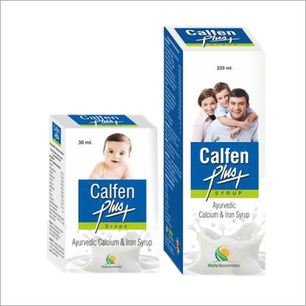

# Calfen plus syrup

Calfen plus syrup can be used as a foundation for the management of any chronic disorder, or to promote optimum health and energy levels. It should be specifically considered for people with depressed mood, fatigue, digestive complaints, memory enhancement, and the effects of aging.  It can also be used as a supportive health measure during times of excess physical or mental stress. It boosts metabolism and checks diarrhea associated with teething in children and relieves indigestion, flatulence and griping.  It can also be used as a supportive health measure.

## SYRUP COMPOSITION
Each 10ml contains extracts of:-

* Bansa (Adhatoda vasica) -                                               500mg
* Jeera (Cuminum cyminum) -                                          300mg
* Saunf (Foeniculum vulgare) -                                        300mg
* Sowa (Anethum sowa) -                                                 300mg
* [Ashwagandha](Ashwagandha.md) ext. (Withania somnifera) -                  200mg
* Khubkalan (Sisymbrium irio) -                                       200mg
* Anantmool (Hemidesmus indicus) -                             100mg
* Manjistha (Rubia cordifolia) -                                        100mg
* Navsar -                                                                              50mg
* Satva Nimbu -                                                                  20mg
* Lohasav -                                                                            2ml
* Lime water -                                                                      2ml
