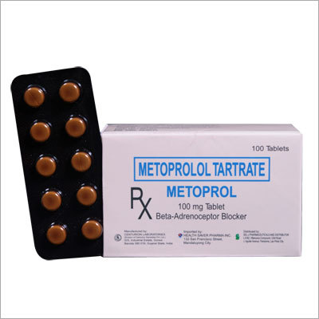

# Cardiovascular System

**Metoprolol Tartrate** - This kind of tartrate is immensely used by our clients so as to decrease the [Blood pressure](../concepts/Blood_pressure.md) levels and heart rate. Along with this, our offered Metoprolol Tartrate is very useful in the treatment of angina symptoms, this drug proves useful.

## External Links
* [Asian Pharmacy](http://www.asianpharmaproducts.com/metoprolol-tartrate-833659.html)
