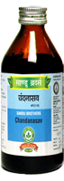

# Chandanasava

[TOC]

**Chandanasava** has diuretic and refrigerant action. It makes urine alkaline and therefore is useful in burning micturition. It is useful in dysuria, oliguria and urinary calculus. It provides symptomatic relief in gonorrhoea and syphilis as it reduces dysaria, burning micturition & pus.

## Indication
Harmaturia, Dysuria, Burning, Micturition, Spermatorrhsea, Leucorrhoea, Ganorrhrea, Urinary calculus.

## Dose
4 tablets 2 times/day

## Ingredients in which used in this preparation
[Santalum album](Santalum_album.md), [Chrysopogon zizanioides](Chrysopogon_zizanioides.md), [Cyperus rotundus - Mustaka](../herbs/Cyperus_rotundus_-_Mustaka.md), [Nelumbo nucifera](../herbs/Nelumbo_nucifera.md), [Madhuca longifolia](Madhuca_longifolia.md), [Rubia cordifolia](Rubia_cordifolia.md), [Mangifera Indica](Mangifera_Indica.md), [Ficus bengalensis](Ficus_bengalensis.md), [Rubia cordifolia](Rubia_cordifolia.md).

## References

## References

1. "Karnataka Medicinal Plants Volume - 2" by Dr.M. R. Gurudeva, Page No.73, Published by Divyachandra Prakashana, #45, Paapannana Tota, 1st Main road, Basaveshwara Nagara, Bengaluru.
