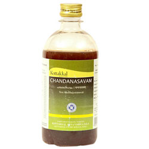

# Chandanasavam

Chandanasava is used in the treatment of spermatorrhoea. It is also used to improve strength. It is a natural cardiac tonic. It also improves digestion power.

Dosage of Kottakkal Ayurveda Chandanasavam

12 – 24 ml usually after food, or as directed by Ayurvedic doctor. It can be mixed with equal quantity of water, if the taste is not tolerated by the patient.

## Ingredients of Kottakkal Ayurveda Chandanasavam
* [Sandal Wood](Sandal_Wood.md) – Santalum album – heart wood – 48 g
* Balaka – Hribera – Pavonia odorata – root – 48 g
* Musta – Cyperus rotundus – rizhome – 48 g
* Gambhari – Gmelina arborea – stem bark and root – 48 g
* Nilotpala – Utpala – Nymphea stellata – flower – 48 g
* Priyangu – callicarpa macrophylla – Flower – 48 g
* Padmaka – Prunus poddum – stem – 48 g
* Lodhra – symplocos racemosa – stem bark – 48 g
* Manjishta – Rubia cordifolia – Root – 48 g
* Raktachandana – Pterocarpus marsupium – Heart wood – 48 g
* Patha – Cyclea peltata – root / whole plant – 48 g
* Kiratatikta – Swertia chiraita – whole plant – 48 g
* Nyagrodha – Ficus benghalensis – stem bark – 48 g
* [Pipali](Pipali.md) – Long pepper – Fruit – 48 g
* Madhuka – Madhuka longifolia – Flower – 48 g
* Rasna – Pluchea lanceolata – Root / whole plant – 48 g
* Patola – pointed gourd leaf 48 g
* Kanchanara – Bauhinia variegata – stem bark – 48 g
* Amratvak – Bark of mango – 48 g
* Mocharasa – Shalmali – Bombax malabaricum – Exudate – 48 g
* Dhataki – Woodfordia fruticosa – Flower – 768 g
* Draksha – Dry grapes – 960 g
* Sharkara – sugar candy – 4.8 kg
* Jaggery – 2.4 kg
* Water – 24.576 liters
