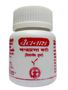

# Chandraprabha bati

[TOC]

## Importance
Chandraprabha Bati is effective in Strengthen urinary tracts & Urinary Troubles, urinary tract infection, difficulty in urination, urinary calculi, Urinary Disorders.

## Dosage
2 tablet twice in a day, before or after food or as directed by physician.

## Indications
1. Excessive urination
1. Burning sensation during urination
1. Retention of urin
1. Renal calculi
1. Ovarian cysts
