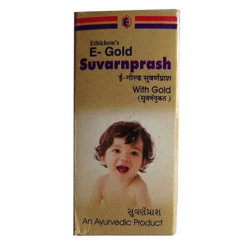

# Child Care Medicines

[TOC]

Suvarnprash helps in promoting and maintaining mental and physical well-being of childrens.

Advantages :
* Child's Growth
* Adds to fight against proneness to diseases
* Increases healthy appetite
* Creates strong immunity power
* Adds to smartness and brightness
* Increase mental growth effectively

## Composition (each ml. contains)
* Baheda - Terminialia ballerica:- 0.09%
* Suvarn Gasaro 0.01%
* [Madhu (Honey)](Madhu_(Honey).md) :- 8%
* Cow Ghee:- 1.99%
* Vaj - Acorus catamus:- 0.02%
* [Brahmi](Brahmi.md) - Centella asaitica 0.01%
* Shankhpushpi - Convolus micropbhyllus:-0.01%
* Syrup Base 89.87%

## External Links
* [Ethichem Laboratories](http://www.indiamart.com/ethichemlaboratories/child-care.html)
