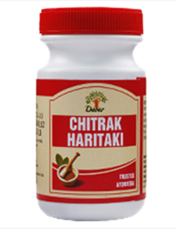

# Chitrak Haritaki

Its two main ingredients, [Chitraka](Chitraka.md) and [Haritaki](Haritaki.md), are  beneficial in improving digestion and treating chronic respiratory conditions. It is highly recommended in treatment of intestinal worms, bloating, asthma, bronchitis, rhinitis and tuberculosis. It also improves overall digestion and strengthens the respiratory system.
