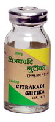

# Chitrakadi Vati

[TOC]

**Chitrakadi Vati** is a *vati* prescribed usually for digestive disorders.
It is said to stimulates secretion of gastric juices, help in digestion of food and said to be useful in irritable bowel syndrome.
The drug is known to have carminative and anti-spasmodic action.

## Indications when the drug is prescribed
* [Indigestion](../concepts/prakriti/Indigestion.md), [Irritable bowel syndrome](../concepts/prakriti/Irritable_bowel_syndrome.md), [Flatulence](../concepts/prakriti/Flatulence.md), [Abdominal colic](../concepts/prakriti/Abdominal_colic.md).

## Generally prescribed dose
1 tablet 2 times a day.

## Ingredients
* [Plumbago zeylanica](Plumbago_zeylanica.md)
* [Piper longum](Piper_longum.md)
* [Piper nigrum](Piper_nigrum.md)
* [Asafoetida](Asafoetida.md)
* [Zingiber officinale](../herbs/Zingiber_officinale.md)
* [Carium](Carium.md)
* [Roxburghianum](Roxburghianum.md)
* [Piper retrofracturn](Piper_retrofracturn.md)
* [Yavkshar](Yavkshar.md)
* [Sajjkshar](Sajjkshar.md)
