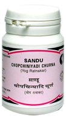

# Chopchinyadi Churna

[TOC]

It is very helpful in treatment of syphilis, gonorrhea, Herpes genitalis and other Venereal diseases.
It is also highly effective in boils, rashes, carbuncles, wounds, Chronic wounds and Fistula.
It is useful in all types of abscess.
It corrects the structural and [Physiology](../physiology/Physiology.md)cal deformity of sperms and thus useful in infertility.

## Ingredients
Smilax china, Sugar, [Pipli](Pipli.md) (Piper longum) , Root of Piper longum, Piper nigrum, Eugenia caryophyllata, Anacyclus pyrethrum, Tribulus terrestris, Zingiber officinale, Embelia ribes, Terminalia chebula, Terminalia bellerica, Embelica officinalis

## Indications
Skin diseases (dry and wet-oozing), abscess, gonorrhea and syphilis, Sperm Disorders

## Dose
1 teaspoonful 2 times
