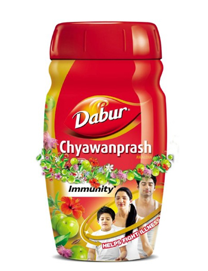

# Chyawanprash

[TOC]

Derived from 2,500-year-old [Ayurvedic medicine](../concepts/Ayurvedic_medicine.md) formula.Totally chemical-free, natural and safe.Combination of herbs and plant extracts in a base of Amla fruit pulp.Refined by Dabur to provide traditional goodness with best quality

## Usage
Dabur Chyawanprash has a tangy sweet-sour taste and the consistency of jam. It can be taken directly or with milk and as bread spread. In winters, have a glass of warm milk after having Chyawanprash. In summers, have a glass of cold milk after having Chyawanprash.

## Dose
    1-2 teaspoonful
