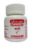

# Citrakadi bati

[TOC]

## Importance
It is used in useful in anorexia, indigestion, [Ama](../concepts/Ama.md) conditions and digestion power improvement.

## Dosage
2 tablet twice in a day, before or after food or as directed by physician.

## Indications
1. Digestion
1. Loss of appetite
1. Antacid, and Stomachic
1. carminative
1. Used in dyspepsia
1. colic & gas problem
