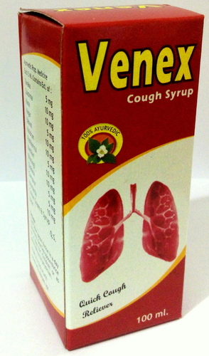

# Cough Syrup

[TOC]

* **Venex** (Herbal Cough Syrup) - This syrup is mostly prescribed by doctor to treat different types of coughs.

## COMPOSITION :-  ( EACH  5ML  CONTAINS  EXT. OF )
* TAVAKA - 5 MG
* SUKSHMA - 10 MG
* KANA - 10 MG
* NAGAR - 5 MG
* BABOOL - 10 MG
* KALIDRUM - 10 MG
* PUSHKARMUL - 5 MG
* BHARANGI - 10 MG
* TANKANA - 5 MG
* CAMPHOR - 5 MG

* **Venuhist** - Useful in brochitis, faryngitis whooping cough in early stages, and useful in allergic cough and cold bronchial asthma.

## COMPOSITION :-  ( EACH  10 ML CONTAINS  EXT. OF )
* TAVAKA - 5 MG
* SUKSHMA - 10 MG
* KANA - 10 MG
* NAGAR - 5 MG
* BABOOL - 10 MG
* KALIDRUM - 10 MG
* PUSHKARMUL - 5 MG
* BHARANGI - 10 MG
* TANKAN  ( PURE ) - 5 MG
* KANTKARI - 10 MG
* KAPUR  ( LIGHT )- 5 MG
* COLOUR  GREEN  &  SUGAR  BASE - Q.S.

## External Links
* [Venus Products](http://www.venusherbalproducts.com/Exporters_Suppliers/Exporters/hp/scripts/prod_search.html?keyword=Cough+Syrup&catalog_id=60043&submit.x=0&submit.y=0)
