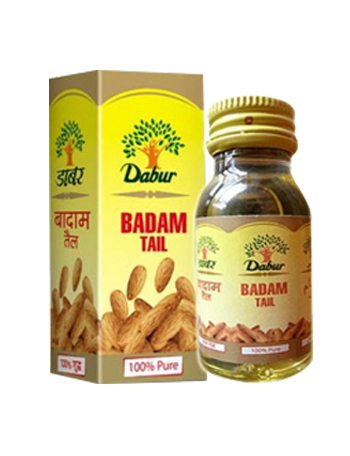

# Dabur Badam Oil

Dabur Badam Oil is obtained from ripe kernels of Prunus Amygdalus. The 100% pure Dabur Badam Oil is extracted from best quality almonds. The oil sharpens brain & strengthens nerves besides improving body strength. It is also a mild laxative, which removes constipation in a natural way. Almond oil also contains vitamin E, which helps in making your skin soft & glowing. Regular application of Dabur Badam Oil on the
scalp makes hair strong & healthy.
