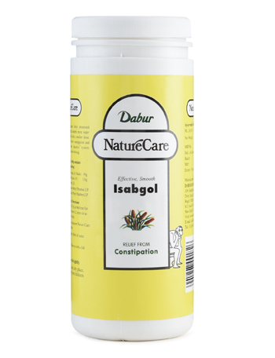

# Dabur Nature Care Regular

**Dabur Nature Care Regular** is a powdered Pysillium-based natural laxative for relief from constipation. Nature Care Regular is sweeter compared to otherwise tasteless Isabgol. It is natural and safe, rich in natural fibre and maintains the overall gut health.

**Indications**
Constipation, irritable bowel syndrome, reduces cholesterol naturally on prolonged usage.

## Dosage
* **Adults**: 1-2 teaspoon at bed time with adequate amount of water
* **Children**: 1/2 teaspoon at bed time with adequate amount of water
