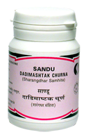

# Dadimashtak Churna

It is mild, cooling, appetizer, pitta pacifying. It corrects the secretion of digestive enzymes.

1. Indications
1. Diarrhoea
1. Anarexia
1. Indigestion
1. caugh
1. Irritable
1. bowel syndrence
1. flatulence.

Dose:
1/2 tsf 2 times a day

## Ingredients
1. Punica granatum
1. piper nigrum
1. sugar
1. [Pipli](Pipli.md) (Piper longum)
1. zingiber officinale
1. Cinnamomum zeylanicum
1. Elettaria cordamomum
1. cinamomum tamata.
