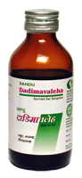

# Dadimavleha

[TOC]

It is appetizer, anti-emetic, heart tonic and diuretic. It is useful in dehydration due to vomiting or diarrhea. It is useful in vomiting of pregnancy. It is useful is anemia. It is also useful in hyperacidity

## Indication
1. Hyperacidity
1. anemia
1. anorexia nervosa
1. heart disease
1. diarrhoea
1. dysentery
1. irritable bowl syndrome.

## Dose
1 tsp 2 times

## Ingredients
1. Punica granatum,
1. Myristica fragrance
1. Piper nigrum
1. Cinnamomum tamala
1. Cinnamomum
1. zeylanicum
1. zingiber officinale
1. [Pipli](Pipli.md) (Piper longum)
1. aromaticum
1. Sugar
