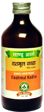

# Dashmoola Kadha

[TOC]

It pacifies vitiated vatadosha. It helps in regaining the strength of the uterus after the delivery. It is useful in diseases like fever, caugh etc.

## Indications
Post-parturn fever, Post partum bleeding, , Vataroga, asthma, pleurisy, arthritis, osteoporosis, etc.

## Dose
2-4 tab 2 times
Therapeutic uses of sandu Dashmool kadha

## Ingredients
Dashmoola
