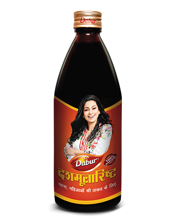

# Dashmularishta

[TOC]

**Dabur Dashmularishta** is nutritional syrup for females primarily for recuperation from post- delivery weakness.
It is an Ayurvedic concoction of more than 50 Ayurvedic herbs including Dashmula, the group of ten herb roots along with [Ashwagandha](Ashwagandha.md), Manjishta and Draksha; which helps in recovering from post-delivery related stress & weakness effectively and naturally.
Dabur Dashmularishta ensures a speedy recovery for new mothers and prepare them physically to face the rigours of motherhood. It also helps in improving metabolism and increases digestion power.

## Benefits
* 100% Ayurvedic
* Good for women to recover from post-delivery weakness
* Rejuvenator & Revitalizer
* Strengthens mind & body
* Improves digestion
* Provides strength & stamina
* Good for skin health & glow
* Fights general weakness & fatigue in women

## Key ingredients and their benefits
**Dashmool**: It is a combination of ten herb roots like Bilva, Agnimantha, Shyonaka, Kantakari etc., which have antioxidant and nutritive properties. In Ayurvedic literature, these herbs find usage in the post-delivery care.
**Manjistha**: It is beneficial for skin health. It acts as a rejuvenator and possesses anti-inflammatory & analgesic properties.
**Ashwagandha**: It is a rejuvenator and has immuno-modulator, anti-stress and antioxidant properties.
**Draksha**: It is nutritious, strengthens body and has antioxidant properties.
**Amalaki & Guduchi**: These are antioxidants and have immuno-modulator properties.
