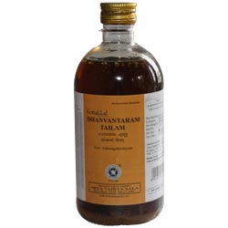

# Dhanwanthari Thailam

[TOC]

[Dhanvantari](../traditions/Dhanvantari.md)haram Thailam is an Ayurvedic oil. It is used in the treatment of Vata diseases such as Rheumatoid and osteo arthritis, spondylosis, headache and neuro-muscular conditions. This oil is based on Kerala Ayurveda practice.

## Dhanwantharam Tailam uses:
* It is used to treat rheumatoid arthritis, osteo-arthritis, neck pain and back ache due to spondylosis,
* It is useful in treatment of neurological conditions such as Neuritis, Neuralgia, paralysis, facial palsy, etc.

## How to use Dhanwantharam oil?
* It is used for massage.
* It is used in Ayurvedic treatment like Dhara, Basti treatment etc.
* 101 times processed oil, called Dhanwantharam 101 -is used for oral administration.
* Dose for oral intake is – 5 – 20 drops once or twice a day, before food, with warm water or warm milk, as directed by Ayurvedic doctor.
* This oil is used for massage for ladies, after delivery, to improve body strength.
* It is also used as massage oil for babies.
* Internal use is advised to relieve fever, bloating and urinary diseases.
