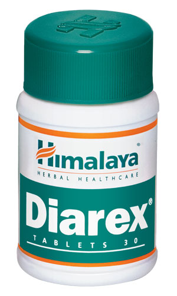

# Diarex

[TOC]

**Diarex** contains a host of natural ingredients with antimicrobial and astringent properties. It eliminates common microorganisms responsible for acute and chronic infectious diarrhea.

Ensures gastrointestinal (GI) health: As an antioxidant, Diarex restores GI health. Diarex’s anti-inflammatory and demulcent properties facilitate healing of the intestinal mucosa, and its antispasmodic action alleviates abdominal colic associated with bowel infection.

## Key ingredients
**Coneru** (Kutaja) is a potent astringent that is helpful in the treatment of amoebic dysentery and diarrhea. It inhibits the growth of salmonella (the genus that causes salmonellosis) and shigella (the genus that causes dysentery).

**[Bael](Bael.md)** (Bilva) fruit has a host of medicinal benefits for intestinal disorders. The unripe Bael fruit has high tannin content, which makes it an effective treatment for dysentery and diarrhea. The fruit exhibits antibacterial and antiviral activity against pathogens which cause intestinal infections such as infectious diarrhea. It alleviates abdominal colic and flatulence because of its antispasmodic and carminative properties. Marmin, a coumarin isolated from the roots, possesses anti-inflammatory properties, which helps in the management of inflammatory intestinal disorders such as colitis.

## List of Ayurvedic herb in which used in this preparation
[Helicteres isora - Avartani](../herbs/Helicteres_isora_-_Avartani.md), [Holarrhena pubescens](Holarrhena_pubescens.md)

## References

## References

1. "Karnataka Medicinal Plants Volume - 2" by Dr.M. R. Gurudeva, Page No.104, Published by Divyachandra Prakashana, #45, Paapannana Tota, 1st Main road, Basaveshwara Nagara, Bengaluru.
