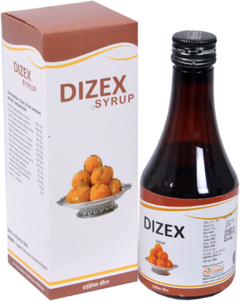

# Digestive Syrup

[TOC]

**Dizex Syrup** shows immediate result in

* Digestive Appetizer,
* Distress of gas trouble,
* Spastic stage of Gastro intestinal tract.
* Digestion & Assimilation.
* Ulcerative Colitis
* Indigestion

## key ingredients
* Kulinjan ( Alpinia galangal. root)
* Phudina (Mentha sylvestris. Leaf)
* Sunth (Zingiber officinalis Rhizome)
* Suva (Anethum Sowa.Frut)
* Ajmo (Trachyspermum Ammi.Frut)
* Dhana (Coriandrum sativum. fruit)
* [Haritaki](Haritaki.md)( Terminalia chebula. fruit)
* Jirru (Cuminum cyminum .Seed)
* Chitrak (Cuminum cyminum .Seed)
* Vavding (Embelia ribes.fruit)
* Mari (Piper nigrum Seed)
* Lindipipper (Piper longum .fruit)

## External Links
[Satyam Health Care](http://www.indiamart.com/satyamhealthcare/digestive-syrup.html)
