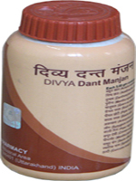

# Divya Dant Manjan

**Divya Dant Manjan** is an herbal tooth powder that helps in whitening of teeth as well as for keeping teeth healthy. It is a natural dental powder which consists of herbs that are traditionally believed to be useful for keeping optimum health of teeth and gums. Divya Dant Manjan is wonderful herbal product that is recommended for the treatment of teeth and gum diseases. The main role of this tooth powder is that it provides nourishment to the teeth and gums. This natural dental powder may be used by people of any age as it is natural and safe. There are no adverse effects produced by this herbal tooth powder. Divya Dant Manjan tooth powder is an herbal product that helps in the treatment of gingivitis, decayed tooth, cavities, etc. It is also recommended for children who get cavities in teeth due to excessive eating of sweets and chocolates. Old people who suffer from weak teeth may also use this natural tooth powder everyday to get relief from toothache.

## Benefits of Divya Dant Manjan
1. Divya Dant Manjan is useful for getting healthy teeth. Regular use of this herbal tooth powder helps to prevent teeth and gum disease.
1. Divya Dant Manjan is beneficial for people who suffer from frequent inflammation of teeth and gums.
1. Divya Dant Manjan helps to prevent decaying of teeth and cavities due to eating of too much sweets and sugary things.
1. Divya Dant Manjan helps to prevent bad breath from the mouth and also provide essential minerals that are required for the development of healthy teeth.
1. Divya Dant Manjan helps to prevent discoloration of teeth or staining of teeth due to chewing of tobacco or smoking cigarettes.
1. Divya Dant Manjan gives freshness in the mouth for a longer period of time and helps in healthy teeth functioning.
1. Divya Dant Manjan decreases the chances of getting pain in tooth due to formation of microbes.
