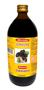

# Drakshasava

[TOC]

## Importance
Baidyanath Drakshasav is effective as a stimulant, antipyretic, diuretic, appetiser and digestive. It is also helpful in piles, asthma, cough, worms, jaundice, and general debility.

## Dosage
20 to 40ml after meals with equal quantity of water or as directed by the physician.

## Indications
1. Useful in Diarrhoea
1. Jaundice
1. Anaemia
1. Piles
1. Also used for Tuberculosis
1. Cough & asthma.
