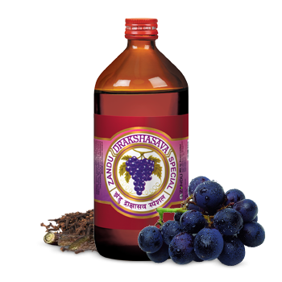

# Drakshasava Special

[TOC]

**Drakshasava** is an excellent preparation enriched with all the goodness to ensure complete general health. The herbs used work on the gastro-intestinal tract, stimulate appetite, improve body strength and energy.

## Composition
Draksha, Kumari, Dhatkipuspa, Ranuk, Chitrak, Nagpuspa, Kankol, Trijat, Lavang, Marich, Piper, Chavak, Pipalimoola, Jatiphal, Sugar etc.

## Dosage
4 tsf mixed with water two times a day after meals or as directed by physician.

* Useful in chronic wasting diseases e.g. Pthisis, Insomnia of Old age, Loss of appetite, Sudden fainting, Cough and maintains strength in acute diseases and General debility.
