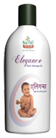

# Elegance Oil

[TOC]

Massage in neonates and infants with medicated oil practiced since ages in the Indian subcontinent, holds true even in modern times. Keeping this view in mind, Elegance is a specially formulated medicated massage oil

It has anti-septic, antibacterial, anti-inflammatory, complexion promoting, cooling and  soothing action.

## Indication
Baby massage oil

## Ingredients
Til oil processed with Curcuma longa, Vitex negundo, Kadupadwal, Trichosanthes dioica, Azadirachta indica, Psoralia corylifolia, Cida cordifolia, Withania somnifera, Berberis aristata, Glycirrhiza glabra, Santalum album,  Rubia cordifolia).
