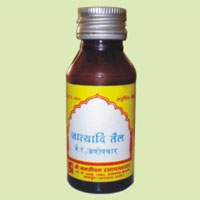

# Essential Oils

1. **Jatyadi Oil**:- Jatyadi Oil is highly effective in treating most of the health problems which are as follows:-
* Healing wounds
* Ulcers
* Skin diseases
* Burns
* Haemorrhoids
* Eczema
* Psoriasis

2. **Mahabhringraj Oil**:- Mahabhringraj Oil is a herbal oil used in Ayurvedic treatment for hair fall, headache, neck pain and stiffness, eye and ear diseases.

3. **Shadbindu Oil**:- Shadbindu Oil is an Ayurvedic herbal oil used in Nasya treatment.It is also used for other problems also which are as follows:-
* Sinusitis
* Headache
* Catarrh
* Snoring
* Cough
* Other diseases of nose

## External Links
* [Sri Navjeewan Rasayanshala](http://www.srinavjeewanrasayanshala.com/essential-oils.htm)
