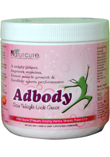

# Food Supplements

* **ADBODY Powder** - A dietary supplement to provide the body of essential amino acids, Proteins, Natural Vitamins & minerals. An immunity booster & blood purifier. Helps in Weight gain & Muscle Building.

* **Spirulina Plus capsules** - The unique Combination of these supplements are useful in Cancer, Heart Diseases, Diabetes Mellitus, Arthritis, all Skin Diseases, Hair falling, Premature greying of Hair, Tension, Obesity, High Blood Pressure, Hypoglycemia, Hyperacidity, Dental Cavities, Anti viral , anti fungal, anti Bacterial, Skin Toner , Dermatitis, eczema, Wounds, Increase the Immunity & Nourish Body Cells.

* **Noni Plus capsules** -  It is Useful in Heart Diseases, Diabetes Mellitus, Arthritis, All Skin Diseases, Obesity, Increase the immunity & to Nourish Body Cells.

Aloe Vera, Noni & Wheat Grass are Exceptional Food & Incredible source of full spectrum, Non Toxic Absorbable Nutrients these are Source of Complete Protein and contains all Nine Essential & other Amino acids.

* **Cell Aid Capsules** - It is estimated that 90% of the World's population may have some form of harmful organism living in the their bodies and don't know it ! Cell Aid is a Unique Dietary Combination formula designed to support your immune system and promote optimal internal health. Cell Aid works with your natural defences & helps to create an environment hostile to invading organisms. It is Useful in Diabetes Mellitus, Arthritis Cancer, all Skin Diseases, Obesity, Increase the immunity & to Nourish Body Cells.

* **Aloevera juice** - Aloe vera leaves contain clear healing juice, which includes 96% water and the remaining 4% contains 75 essential nutrients including vitamin A, B, C,E, Calcium, Amino Acid and Enzymes. From the 250 species existing, Aloe vera is best known for its medicinal properties . It is used for healing different diseases. Moreover, the juice of Aloe vera is 100% non-toxic, with rare side effects. Aloe vera, in the liquid form, act as an excellent regulator for intestine & a food supplement, containing different essential nutrients, Further, it facilitates digestion, activates blood & lymphatic circulation and alleviates arthritic & rheumatic pains. Aloe vera is used widely in Dermatology, as it acts as an astringent, moisturiser, humidifier and cleanser. It softens the skin, diminished wrinkles and cures acne, seborrhea, herpes, red spot, psoriasis, eczema, mycosis, fever blisters, skin irritation and provides protection to the skin against pollution.

* **Strength up rose flavour syrup** -  It is a unique tonic for physical and mental weakness. It is very useful in improving & recollecting power of brain & removing the general debility, physical and mental exhaustion. It is recommended for anorexia, convalescence & all types of Anaemia, improper digestion and fatigue.

* **Strength up lemon flavour syrup** -  It is a unique tonic for physical and mental weakness. It is very useful in improving & recollecting power of brain & removing the general debility, physical and mental exhaustion. It is recommended for anorexia, convalescence & all types of Anaemia, improper digestion and fatigue.

## External Links
* [A & D Pharma](http://www.adpharmakkp.com/adbody_helth.aspx#go)
