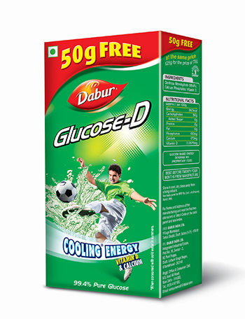

# Glucose

[TOC]

Get a jump start on your day by filling up with the extra energy of Dabur Glucose-D. Enriched with Vitamin-D and Calcium for easy assimilation and quick replenishment of essential vitamins, minerals and body salts, Dabur Glucose is a ready source of energy to fight tiredness. It refreshes you instantly.

Besides helping in quick recovery of energy lost due to fatigue, Dabur Glucose also provides essential nutrients that refresh and energizes you to fight tiredness and fatigue caused by summer heat. Extremely good for growing children and sportspersons, Dabur Glucose also helps in all-round development of kids.

## Contains
1. High grade Dextrose
1. Monohydrate
1. Vitamin D
1. Calcium
1. Storage

## Information
Glucose-D Expiry 24 months from date of manufacture
GlucoPlus-C Expiry 12 months from date of manufacture
