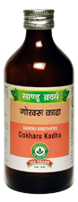

# Gokharu Kadha

[TOC]

It has diuretic, lithotriptic, anti-inflammatory analgesic action. It breaks stones into very small pieces and then flushes them out. It gives relief from the symptoms of dysuria, haematuria, frequency and burning micturition. It also prevents recurrence of stone if used regularly. It also relieves pain associated with calculus.

## Indication
1. Urinary calculus
1. urinary tract infection
1. oliguria, haematuria
1. glomerulonephritis
1. semen disorders.

## Dose
4-6 tsf 2 to 3 times

## Ingredients
Tribulus terrestris
