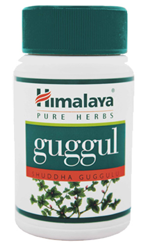

# Guggul

[TOC]

A herb that helps regulate the lipid metabolism, showing excellent results in weight control and body fat reduction. It modulates your lipid profile.

## Indications:
Hyperlipidemia, obesity.

## Use Directions:
Take 1 or 2 capsules twice daily with meals.
