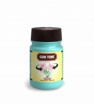

# Gum Tone Powder

A herbal powder for healthy gums
GUM TONE is a unique formulation of astringents which tightens gums and arrests bleeding. Babbul (Acacia arabica) and Bakul (Mimusops elengi) in GUM TONE inhibits the growth of salivary bacteria and prevents the formation of cavities. Shuddha phitkari (Alum) strengthens the gums and arrests bleeding. Vajradanti (Barleria prionitis), Lavang (Caryophyllus aromaticus), Amalaki (Emblica officinalis) and Khadir (Acacia catechu) have antibacterial & antiplaque activity. Karpoor (Camphora officinarum), Kaiphal (Myrica nagi) and Saindhav offer a long lasting natural fresh breath. Nirgundi (Vitex negundo) and Kankola (Piper cubeba) are antiinflammatory and analgesic. Regular use of GUM TONE is recommended especially in diabetic patients who are prone to develop gingivitis. GUM TONE is also recommended for regular use to maintain oral hygiene.
