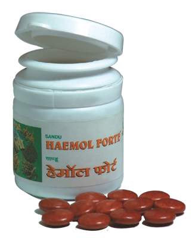

# Haemol Forte

[TOC]

**Natural Iron Supplement**

It stimulates synthesis of haemoglobin and provides rapid improvement in haemoglobin level. It is indicated in all types and stages of anaemia. It is believed to stimulate secretion of apotransferrine from liver through bile for better absorption of iron from all parts of small intestine.

It is well tolerated and provides adequate elemental iron in therapeutic dosage for progressive haemopoesis.
It also provides calcium and many other trace elements to boost cellular metabolism.

## Indications
Iron deficiency anaemia, nutritional anaemia, pregnancy.

## Dose
1 tablet 2 times per day.

## Ingredients
1. Punarnava Mandoor,
1. Lohabhasma,
1. Tamrabhasma,
1. Abhrakbhasma 100 puti,
1. Purified Parad,
1. Purified Gandhak,
1. Zingiber officinale,
1. Piper longum,
1. Piper nigrum, etc.
